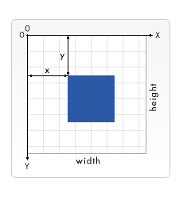
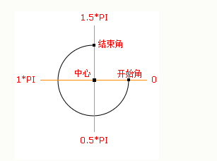

<h3>基本概念讲解</h3>
>坐标原点(0,0)在canvas画布的的左上角。同样的分为x和y两个轴。x轴向右为正值，y轴向下为正值。同样在canvas中，是没有办法直接看到。但同样，在canvas中使用负坐标不会导致canvas不能使用，只不过会移到canvas画布的外面。

    
在canvas中只支持一种绘图绘制: <font color ='#f40'>矩形绘制</font>,其他方式都至少生成一条路径 .

1.fillRect(x, y, width, height)绘制一个填充的矩形


2.strokeRect(x, y, width, height)绘制一个矩形的边框

3.clearRect(x, y, width, height)清除指定矩形区域，让清除部分完全透明。


```js
ctx.fillRect(25, 25, 100, 100);
ctx.clearRect(45, 45, 60, 60);
ctx.strokeRect(50, 50, 50, 50);
```

<h4>绘制路径</h4>

+ beginPath() --> 新建一条路径,也就是画笔绘画的路径.
+ closePath() --> 闭合路径之后,绘画路径,重新返回上下文中.
+ stroke()    --> 通过线条绘制图像轮廓
+ fill()      --> 填充路径内的图像,生成黑块


><font color="#f40"> 注意：当前路径为空，即调用beginPath()之后，或者canvas刚建的时候，第一条路径构造命令通常被视为是moveTo（），无论实际上是什么。出于这个原因，你几乎总是要在设置路径之后专门指定你的起始位置。</font>


```js
    ctx.beginPath();
    ctx.moveTo(75, 50);
    ctx.lineTo(100, 75);
    ctx.lineTo(100, 25);
    ctx.fill();
```


<h4>移动笔</h4>

+ moveTo(x,y) --> 将笔触移动到指定的坐标x以及y上

```js
 ctx.beginPath();
 ctx.moveTo(25,25);
 ctx.lineTo(105,25);
 ctx.lineTo(25,105);
 ctx.fill();

```

<h4>圆弧</h4>

+ arc(x, y, radius, startAngle, endAngle, anticlockwise) --> 方法创建弧/曲线（用于创建圆或部分圆）。 x,y为绘制圆弧所在圆上的圆心坐标。radius为半径。startAngle以及endAngle参数用弧度定义了开始以及结束的弧度。这些都是以x轴为基准。参数anticlockwise为一个布尔值。为true时，是逆时针方向，否则顺时针方向。
><font color='#f40'>arc()函数中表示角的单位是弧度，不是角度。角度与弧度的js表达式:
    弧度=(Math.PI/180)*角度。</font>



```js
function drawRrc() {
    var canvas = document.getElementById('canvas');
    if (canvas.getContext) {
        var ctx = canvas.getContext('2d')
        ctx.beginPath();
        ctx.arc(75, 75, 50, 0, 20*(Math.PI/180),false); // 绘制  控制方向false 顺时针 ,true 逆时针 
        ctx.stroke()
    }
}
```


<h4>二次贝塞尔曲线及三次贝塞尔曲线 </h4> 

+ quadraticCurveTo(cp1x, cp1y, x, y) 绘制二次贝塞尔曲线，cp1x,cp1y为一个控制点，x,y为结束点。
+ bezierCurveTo(cp1x, cp1y, cp2x, cp2y, x, y)  绘制三次贝塞尔曲线，cp1x,cp1y为控制点一，cp2x,cp2y为控制点二，x,y为结束点。
[详细了解](https://www.cnblogs.com/joyho/articles/5817170.html)

 


```js

ctx.beginPath();
 ctx.moveTo(75,25);
 ctx.quadraticCurveTo(25,25,25,62.5);
 ctx.quadraticCurveTo(25,100,50,100);
 ctx.quadraticCurveTo(50,120,30,125);
 ctx.quadraticCurveTo(60,120,65,100);
 ctx.quadraticCurveTo(125,100,125,62.5);
 ctx.quadraticCurveTo(125,25,75,25);
 ctx.stroke();
  }

//三次贝塞尔曲线
 ctx.beginPath();
 ctx.moveTo(75,40);
 ctx.bezierCurveTo(75,37,70,25,50,25);
 ctx.bezierCurveTo(20,25,20,62.5,20,62.5);
 ctx.bezierCurveTo(20,80,40,102,75,120);
 ctx.bezierCurveTo(110,102,130,80,130,62.5);
 ctx.bezierCurveTo(130,62.5,130,25,100,25);
 ctx.bezierCurveTo(85,25,75,37,75,40);
 ctx.fill();
  }

  // 封装的一个用于绘制圆角矩形的函数.

function roundedRect(ctx,x,y,width,height,radius){
  ctx.beginPath();
  ctx.moveTo(x,y+radius);
  ctx.lineTo(x,y+height-radius);
  ctx.quadraticCurveTo(x,y+height,x+radius,y+height);
  ctx.lineTo(x+width-radius,y+height);
  ctx.quadraticCurveTo(x+width,y+height,x+width,y+height-radius);
  ctx.lineTo(x+width,y+radius);
  ctx.quadraticCurveTo(x+width,y,x+width-radius,y);
  ctx.lineTo(x+radius,y);
  ctx.quadraticCurveTo(x,y,x,y+radius);
  ctx.stroke();
}
```

