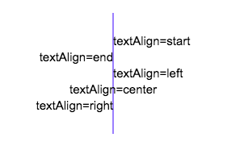
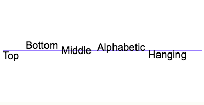

## 绘制文本  ##

> #### 填充/描边方法 ####

+ fillText(text, x, y [, maxWidth]) 在指定的(x,y)位置填充指定的文本，绘制的最大宽度是可选的.    
    ```js
    var c=document.getElementById("myCanvas");
    var ctx=c.getContext("2d");

    ctx.font="20px Georgia";
    ctx.fillText("Hello World!",10,50);

    ctx.font="30px Verdana";
    // Create gradient
    var gradient=ctx.createLinearGradient(0,0,c.width,0);
    gradient.addColorStop("0","magenta");
    gradient.addColorStop("0.5","blue");
    gradient.addColorStop("1.0","red");
    // Fill with gradient
    ctx.fillStyle=gradient;
    ctx.fillText("w3school.com.cn",10,90);
    ```

+ strokeText(text, x, y [, maxWidth]) 在指定的(x,y)位置绘制文本边框，绘制的最大宽度是可选的 描边.
    ```
    ctx.strokeStyle=gradient;
    ctx.strokeText("w3school.com.cn",10,90);
    ```


> #### 文本样式 ####

+ font = value 当前我们用来绘制文本的样式. 这个字符串使用和 CSS font 属性相同的语法. 默认的字体是 10px sans-serif。
+ textAlign = value 文本对齐选项. 可选的值包括：start, end, left, right or center. 默认值是 start。

    
+ textBaseline = value 基线对齐选项. 可选的值包括：top, hanging, middle, alphabetic, ideographic, bottom。默认值是 alphabetic。

    
+ direction = value 文本方向。可能的值包括：


