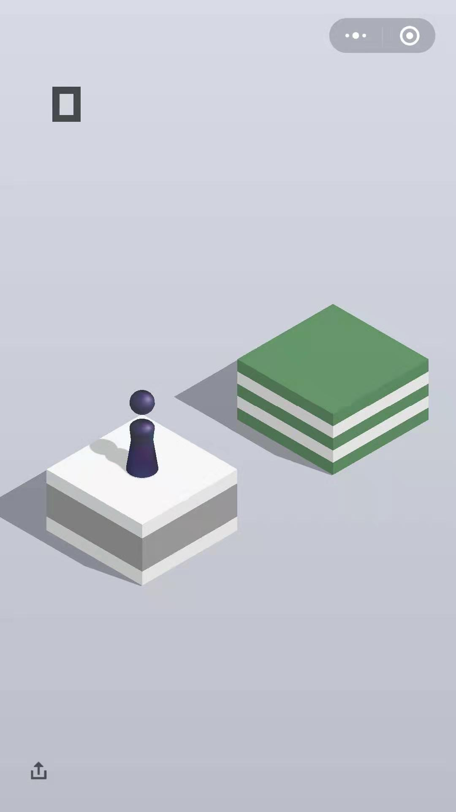
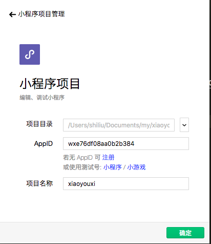
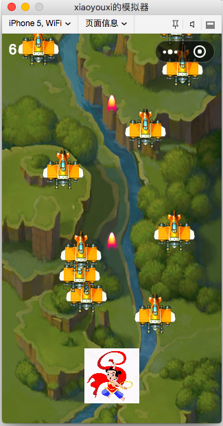

# 快速入门
#### 相关例子 
##### >>>>>>眺一跳(首发例子)
<!--  -->

#### 微信小程序默认例子
   1.载微信开发工具 [下载地址](https://developers.weixin.qq.com/miniprogram/dev/devtools/download.html)

   2.默认打开
   

    
   

   3.默认的打飞机
   

       
   

##### 开发基础条件
   <ul>
       <li>前端基础知识</li>
       <li>一定程度的js 知识</li>
       <li>最好有前端开发环境,IDE</li>
   </ul>

