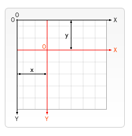
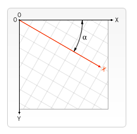

# 状态保存/变形


#### 状态的保存和恢复

- [`save()`](https://developer.mozilla.org/zh-CN/docs/Web/API/CanvasRenderingContext2D/save)[`restore()`](https://developer.mozilla.org/zh-CN/docs/Web/API/CanvasRenderingContext2D/restore)save 和 restore 方法是用来保存和恢复 canvas 状态的，都没有参数。Canvas 的状态就是当前画面应用的所有样式和变形的一个快照。

#### 移动

- translate(x, y)  translate方法接受两个参数。x 是左右偏移量，y 是上下偏移量，

  ​	

  

```js
function draw() {
  var ctx = document.getElementById('canvas').getContext('2d');
  for (var i = 0; i < 3; i++) {
    for (var j = 0; j < 3; j++) {
      ctx.save();
      ctx.fillStyle = 'rgb(' + (51 * i) + ', ' + (255 - 51 * i) + ', 255)';
      ctx.translate(10 + j * 50, 10 + i * 50);
      ctx.fillRect(0, 0, 25, 25);
      ctx.restore();
    }
  }
}
```

#### 旋转

- rotate(angle) ->旋转的弧度,旋转的中心是canvas 的原点




```js
var c=document.getElementById("myCanvas");
var ctx=c.getContext("2d");
ctx.rotate(20*Math.PI/180);
ctx.fillRect(50,20,100,50);
```


#### 缩放

- scale(x,y) x,y 表示缩放比,  >1放大   <1 缩小   == 1 不变

  

```js
var c=document.getElementById("myCanvas");
var ctx=c.getContext("2d");
ctx.strokeRect(5,5,25,15);
ctx.scale(2,2);
ctx.strokeRect(5,5,25,15);
```


#### 转换矩阵

+ transform(a,b,c,d,e,f)  

  a：水平方向的缩放

  b：水平方向的倾斜偏移 Math.tan( deg *Math.PI/180)

  c：竖直方向的倾斜偏移 Math.tan( deg *Math.PI/180)

  d：竖直方向的缩放 

  e：水平方向的移动

  f：竖直方向的移动

```
**setTransform(m11, m12, m21, m22, dx, dy)**
```

这个方法会将当前的变形矩阵重置为单位矩阵，然后用相同的参数调用 `transform `方法。如果任意一个参数是无限大，那么变形矩阵也必须被标记为无限大，否则会抛出异常。从根本上来说，该方法是取消了当前变形,然后设置为指定的变形,一步完成。


```js
var c=document.getElementById("myCanvas");
var ctx=c.getContext("2d");

ctx.fillStyle="yellow";
ctx.fillRect(0,0,250,100)

ctx.transform(1,0.5,-0.5,1,30,10);
ctx.fillStyle="red";
ctx.fillRect(0,0,250,100);

ctx.setTransform(1,0.5,-0.5,1,30,10);
ctx.fillStyle="blue";
ctx.fillRect(0,0,250,100);

```

